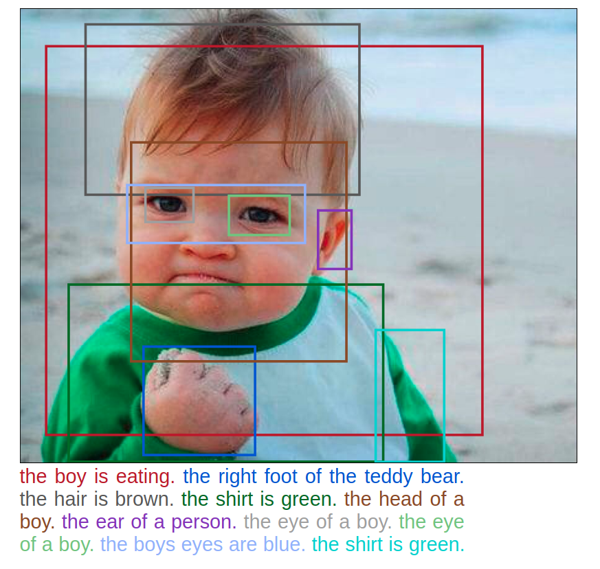
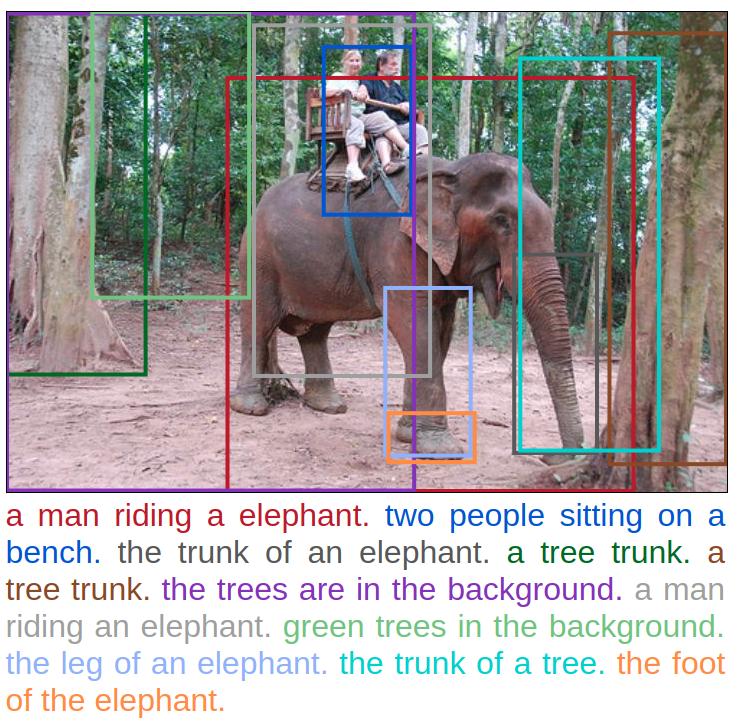

# Densecap-tensorflow

Implementation of CVPR2017 paper: [Dense captioning with joint inference and visual context](https://arxiv.org/abs/1611.06949) by **Linjie Yang, Kevin Tang, Jianchao Yang, Li-Jia Li**

**WITH CHANGES:**  
1. Borrow the idea of [Tying Word Vectors and Word Classifiers: A Loss Framework for Language Modeling](https://arxiv.org/abs/1611.01462), and tied word vectors and word classfiers during captioning.
2. Initialize Word Vectors and Word Classifers with pre-trained [glove](https://nlp.stanford.edu/projects/glove/) word vectors with dimensions of 300.
3. Change the backbone of the framework to ResNet-50.
4. Add `Beam Search` and `Length Normalization` in test mode.
5. Add "Limit_RAM" mode when praparing training date since my computer only has RAM with 8G.

<div align="center">
    
    
</div>

**Special thanks to [valohai](https://valohai.com/) for offering computing resource.**

## Note

**Update 2017.12.31**  

* After 500k iterations of training with configurations of original paper (except for the weights tying of wordvec and classifiers), it achieves **mAP 8.296**.

**Update 2017.12.20**  

* After 1 epoch(80000 iters) of training with randomly initialized word vectors(512d), it achieves **mAP 6.509**. 
* After 1 epoch(75000) of training with pre-trianed glove word vectors(300d), it got **mAP 5.5** nearly.
* The complete training process will take almost **10 days** with the computation I have access to, and I just trained 1 epoch to varify the framework for now.
* The scripts should be compatible with both python 2.X and 3.X. Although I built it under python 2.7.
* Tested on Ubuntu 16.04, tensorflow 1.4, CUDA 8.0 and cudnn 6.0, with GPU Nvidia gtx 1060(LOL...).

## Dependencies

To install required python modules by:

```commandline
pip install -r lib/requirements.txt
```

**For evaluation, one also need:**  
* java 1.8.0
* python 2.7(according to 
[coco-caption](https://github.com/tylin/coco-caption))

To install java runtime by:  
```commandline
sudo apt-get install openjdk-8-jre
```

## Preparing data

### Download

[Website of Visual Genome Dataset](http://visualgenome.org/api/v0/api_home.html)

* Make a new directory `VG` wherever you like.
* Download `images` Part1 and Part2, extract `all (two parts)` to directory `VG/images`
* Download `image meta data`, extract to directory `VG/1.2` or `VG/1.0` according to the version you download.
* Download `region descriptions`, extract to directory `VG/1.2` or `VG/1.0` accordingly.
* For the following process, we will refer **the absolute path** of directory `VG` as `raw_data_path`, e.g. `/home/user/git/VG`.

### Unlimit RAM

If one has RAM more than 16G, then you can preprocessing dataset with following command.
```shell
$ cd $ROOT/lib
$ python preprocess.py --version [version] --path [raw_data_path] \
        --output_dir [dir] --max_words [max_len]
```

### Limit RAM (Less than 16G)

If one has RAM `less than 16G`.
* Firstly, setting up the data path in `info/read_regions.py` accordingly, and run the script with python. Then it will dump `regions` in `REGION_JSON` directory. It will take time to process more than 100k images, so be patient.
```shell
$ cd $ROOT/info
$ python read_regions --version [version] --vg_path [raw_data_path]
```
* In `lib/preprocess.py`, set up data path accordingly. After running the file, it will dump `gt_regions` of every image respectively to `OUTPUT_DIR` as `directory`.
```shell
$ cd $ROOT/lib
$ python preprocess.py --version [version] --path [raw_data_path] \
        --output_dir [dir] --max_words [max_len] --limit_ram
```

## Compile local libs

```shell
$ cd root/lib
$ make
```

## Train

Add or modify configurations in `root/scripts/dense_cap_config.yml`, refer to 'lib/config.py' for more configuration details.
```shell
$ cd $ROOT
$ bash scripts/dense_cap_train.sh [dataset] [net] [ckpt_to_init] [data_dir] [step]
```

Parameters:
* dataset: `visual_genome_1.2` or `visual_genome_1.0`.
* net: res50, res101
* ckpt_to_init: pretrained model to be initialized with. Refer to [tf_faster_rcnn](https://github.com/endernewton/tf-faster-rcnn) for more init weight details.
* data_dir: the data directory where you save the outputs after `prepare data`.
* step: for continue training. 
    - step 1: fix convnet weights
    - stpe 2: finetune convnets weights
    - step 3: add context fusion, but fix convnets weights
    - step 4: finetune the whole model.

## Demo

Create a directory `data/demo`
```sh
$ mkdir $ROOT/data/demo
```
Then put the images to be tested in the directory. 

**Download pretrained model (iters 500k)** by [Google Drive](https://drive.google.com/file/d/1yoJGXXpeSpQbU-6WpLsMXFLIka7xpTAy/view?usp=sharing) 
or [Jbox](https://jbox.sjtu.edu.cn/l/j5EeUN). Then create a "output" 
directory under `$ROOT`
```sh
$ mkdir $ROOT/output
```
Extract the downloaded "ckpt.zip" to directory `$ROOT/output`.
And run
```sh
$ cd $ROOT
$ bash scripts/dense_cap_demo.sh ./output/ckpt ./output/ckpt/vocabulary.txt
```
or run
```sh
$ bash scripts/dense_cap_demo.sh [ckpt_path] [vocab_path]
```
for your customized checkpoint directory.

It will create html files in `$ROOT/demo`, just click it.
Or you can use the web-based visualizer created by [karpathy](https://github.com/karpathy) by
```sh
$ cd $ROOT/vis
$ python -m SimpleHTTPServer 8181
```
Then point your web brower to [http://localhost:8181/view_results.html](http://localhost:8181/view_results.html).

## TODO:

- [x] preprocessing dataset.
- [x] roi_data_layer & get data well prepared for feeding.
- [x] proposal layer
- [x] sentense data layer
- [x] embedding layer
- [x] get loc loss and caption loss
- [x] overfit a mini-batch
- [x] context fusion
- [x] add experiment result.

## References

* The Faster-RCNN framework inherited from repo [tf-faster-rcnn](https://github.com/endernewton/tf-faster-rcnn) by [endernewton](https://github.com/endernewton)
* The official repo of [densecap](https://github.com/linjieyangsc/densecap)
* [Tying Word Vectors and Word Classifiers: A Loss Framework for Language Modeling](https://arxiv.org/abs/1611.01462)
* Official tensorflow models - "im2text".
* Adapted web-based visualizer from [jcjohnson](https://github.com/jcjohnson)'s [densecap repo](https://github.com/jcjohnson/densecap)
